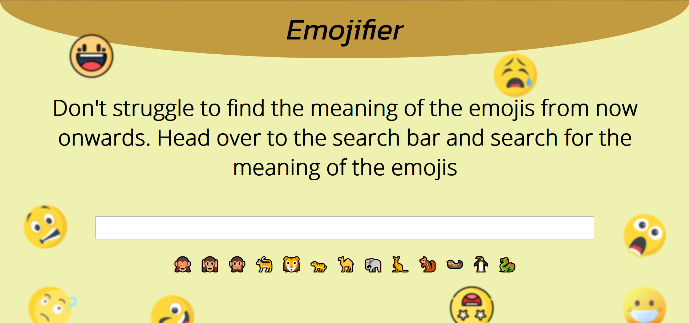
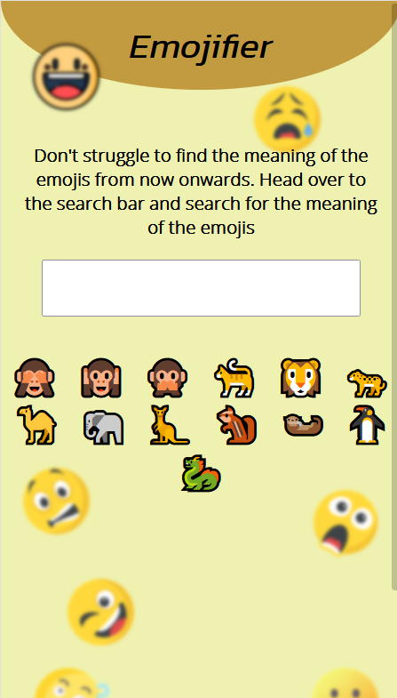

  

## About

 This React application identifies the emojis and tells you the correct meaning of the emojis.

### Check out [👉 Live here 👈](https://dcs-emojifier.netlify.app)

#### Tech Stack

&nbsp; &nbsp; &nbsp;

